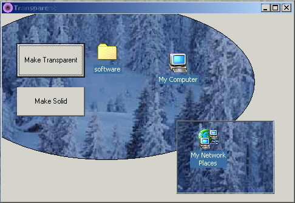

<div align="center">

## turn a color on form transparent


</div>

### Description

Turn a certain color on the form or controls transparent
 
### More Info
 
Send the sub in module the form name or just me

and the color to make transparent

TransForm Me, rgb(0,0,0) Makes everything black on the form transparent

none yet


<span>             |<span>
---                |---
**Submitted On**   |
**By**             |[Matt](https://github.com/Planet-Source-Code/PSCIndex/blob/master/ByAuthor/matt.md)
**Level**          |Beginner
**User Rating**    |3.7 (11 globes from 3 users)
**Compatibility**  |VB 6\.0
**Category**       |[Windows API Call/ Explanation](https://github.com/Planet-Source-Code/PSCIndex/blob/master/ByCategory/windows-api-call-explanation__1-39.md)
**World**          |[Visual Basic](https://github.com/Planet-Source-Code/PSCIndex/blob/master/ByWorld/visual-basic.md)
**Archive File**   |[](https://github.com/Planet-Source-Code/matt-turn-a-color-on-form-transparent__1-23653/archive/master.zip)

### API Declarations

```
'windows 2000 only
'in module
'constants for transparency subs
Const LWA_COLORKEY = &H1
Const LWA_ALPHA = &H2
Const GWL_EXSTYLE = (-20)
Const WS_EX_LAYERED = &H80000
'api's for transparency subs
Private Declare Function GetWindowLong Lib "user32" Alias "GetWindowLongA" (ByVal hWnd As Long, ByVal nIndex As Long) As Long
Private Declare Function SetWindowLong Lib "user32" Alias "SetWindowLongA" (ByVal hWnd As Long, ByVal nIndex As Long, ByVal dwNewLong As Long) As Long
Private Declare Function SetLayeredWindowAttributes Lib "user32" (ByVal hWnd As Long, ByVal crKey As Long, ByVal bAlpha As Byte, ByVal dwFlags As Long) As Long
Public Sub TransForm(frmTrans As Form, transColor As Long)
 Dim Ret As Long
 Ret = GetWindowLong(frmTrans.hWnd, GWL_EXSTYLE)
 Ret = Ret Or WS_EX_LAYERED
 SetWindowLong frmTrans.hWnd, GWL_EXSTYLE, Ret
 SetLayeredWindowAttributes frmTrans.hWnd, transColor, 255, LWA_COLORKEY
End Sub
Public Sub untransForm(frmunTrans As Form)
 Dim Ret As Long
 Ret = GetWindowLong(frmunTrans.hWnd, GWL_EXSTYLE)
 Ret = Ret Or WS_EX_LAYERED
 SetWindowLong frmunTrans.hWnd, GWL_EXSTYLE, Ret
 SetLayeredWindowAttributes frmunTrans.hWnd, 0, 255, LWA_ALPHA
End Sub
```


### Source Code

```
' in form with 2 command buttons
'cmdMakeTransparent
'cmdNoTransparency
Private Sub cmdMakeTransparent_Click()
 'transform formname or me for current form, color which could be
 'vbWhatever or rgb(r,g,b) or long number value
 TransForm Me, vbWhite 'set the see through color to white
End Sub
Private Sub cmdNoTransparency_Click()
 untransForm Me 'set nothing to transparent
End Sub
```

